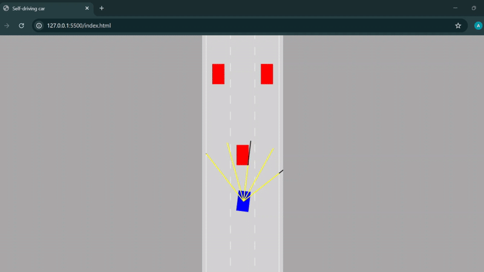
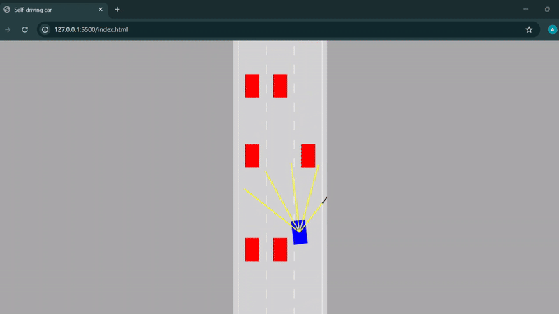

# 🚗 Self-Driving Car Simulation (JavaScript)

A **browser-based self-driving car simulation** built using **vanilla JavaScript** and **HTML Canvas**, without any external libraries.  
This project demonstrates the fundamental concepts behind autonomous driving such as car physics, sensor simulation, collision detection, and AI-based decision making.

---

## 🎥 Demo

### 🟢 Demo 1:


### 🟣 Demo 2:


---

## 🧠 Features
- 🚘 Car movement with realistic controls
- 🛣️ Road and lane rendering using HTML Canvas
- 📡 Sensor simulation using ray casting
- 💥 Collision detection with road borders and traffic
- 🤖 AI-based decision making using a simple neural network
- 👀 Visualized sensors and decision process

---

## 🛠️ Technologies Used
- HTML  
- CSS  
- JavaScript  
- HTML Canvas API  

---

## 🚀 How to Run the Project
1. Clone the repository:
   ```bash
   git clone https://github.com/Ankit6321/Self-driving-car.git

---

## 📚 Learning Reference
This project is being developed by following and understanding concepts from the tutorial:

Self Driving Car – No Libraries, Just JavaScript  
https://www.youtube.com/watch?v=Rs_rAxEsAvI

